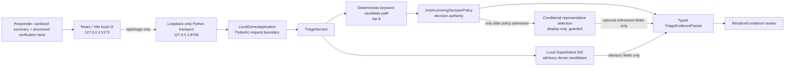

# Architecture and Decision Boundaries

## Goal

The system isolates one reliability question:

> Can historical incident evidence be surfaced without allowing semantic similarity, retrieval rank, procedure availability, or a browser UI to create unsafe operational anchoring?

The implementation is intentionally local-first and provider-neutral at core boundaries.

## Runtime topology



## Authority boundaries

| Layer | Allowed responsibility | Explicitly not allowed |
|---|---|---|
| React/Vite UI | Collect sanitized structured input; render typed packet; keep advanced detail inspectable | Retrieval, policy, procedure eligibility, provider calls, final decisions |
| Loopback Python transport | Enforce loopback bind, request size/type checks, safe error envelopes | Persistence, accounts, customer ingestion, public serving |
| `LocalDemoApplication` | Validate browser payload, generate request/trace IDs, invoke typed service | Policy evaluation or retrieval implementation |
| `TriageService` | Compose the governed typed packet | Browser-facing presentation decisions |
| Keyword candidate path | Feed policy candidates | Decide safe evidence admission |
| `AntiAnchoringDecisionPolicy` | Decision state, admitted precedents, missing facts, conflicts, procedure eligibility, degraded behavior | Execute procedures, infer unverified facts |
| Local Superlinked SIE | Return bounded semantic advisory evidence | Override policy authority or execution posture |
| Conditional representative selection | Refine display among already-admitted candidates when preconditions hold | Change decision state, missing facts, procedure eligibility, degraded behavior |
| Candidate procedure | Offer review-only investigation material | Execute, mutate infrastructure, or authorize action |

## Packet contract

The browser receives a typed `TriageEvidencePacket` instead of UI-specific decision fragments.

At minimum, the packet contains:

```text
policy_decision
semantic_advisory
representative_selection
procedure_execution_authorized
request_id
trace_id
```

The packet is the explainable contract between governed runtime behavior and presentation. Raw packet JSON remains inspectable in the UI so a reviewer can distinguish server evidence from display language.

## Decision sequence

```text
1. Validate sanitized typed intake.
2. Generate request and trace IDs server-side.
3. Retrieve deterministic keyword candidates for the policy path.
4. Produce local SIE dense candidates as advisory context.
5. Apply AntiAnchoringDecisionPolicy:
   - evidence admission;
   - decision state;
   - missing facts;
   - conflict;
   - candidate procedure eligibility;
   - provider-degraded behavior.
6. Optionally evaluate display-only representative selection:
   - only when valid typed intake exists;
   - only after policy admission;
   - only within the permitted same-family scope;
   - only when selection preconditions are satisfied.
7. Return one typed evidence packet.
8. Render the packet without adding browser-side inference.
```

## Failure posture

| Failure / uncertainty | System behavior |
|---|---|
| Unsafe or insufficient comparable precedent | Return `insufficient_precedent`; do not invent a match |
| More than one plausible family | Return `evidence_found_with_conflict`; do not choose a preferred procedure |
| Critical facts are not verified | Return `missing_critical_facts`; do not treat unknown as confirmed |
| Required provider unavailable | Return `provider_degraded`; do not present precedent/procedure candidates |
| Invalid display-selection intake | Do not apply refinement; preserve the policy-admitted set |
| Procedure candidate present | Keep `procedure_execution_authorized=false` |

## Local-only privacy posture

- Browser input is bounded, structured, and not persisted.
- The transport binds only to loopback interfaces.
- No public endpoint, account system, upload flow, telemetry store, or connector is included.
- The corpus is synthetic RelayOps data.
- Real post-mortems, raw logs, customer identifiers, credentials, or secrets must not be entered.

## Why this is maintainable

The system separates:

```text
deterministic application policy
!= semantic advisory retrieval
!= display refinement
!= browser rendering
!= execution authority
```

That separation makes future change safer. A new retriever, selector, UI, or provider adapter must prove that it does not silently gain authority held by the policy boundary.
